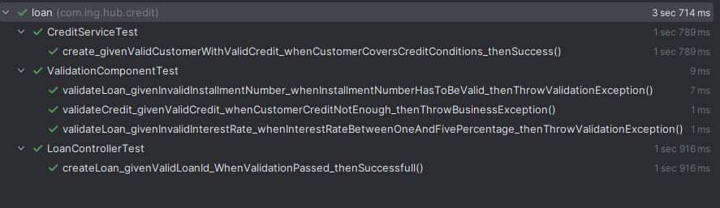

# loan-service
Credit Module Loan API. This is a case example project for implementing given use-cases.
In the use case it is mentioned as build the project as it will be used in production or production ready environement,
so i try to build the project with real environment configurations and tools. Like Database i used Postgresql. And make the 
bridges with almost pure native bridges which is used in MyBatis to make the query time perform better.

## How To Run
Before cloning the project, you have to run this : git config --global core.autocrlf false . This command disable auto saving files in windows format if your working on 
windows. docker-entrypoint.sh  files converted to Windowx (CR LF)  which prevent this file run on docker. so we need to disable it in git configuration first.
Please follow these steps one by one. There are some screen shot which will help u through cloning and running the project, please follow steps one-by-one. 

* > git config --global core.autocrlf false
* > git clone https://github.com/kparlar/loan-service.git
  

  
enter loan-service folder and run below commands.

* > cd loan-service
* > mvn clean install
* > docker compose up

  

* > Then open any browser and go to this link: http://localhost:8081/v1/credit-loan/swagger-ui/index.html

Docker compose output screen is given below. I have highlighted flyway script logs too.

## Tech Stack Card
This app is built on SpringBoot, java backend project. Given below related frameworks and tools used. 

* Spring Boot 3.4.2
* MyBatis Spring 3.0.3
* Database: Postgresql
* Unit Test: Junit 5

## Api End Points
OpenAPI is used in this project
You can check it from this link: http://localhost:8081/v1/credit-loan/swagger-ui/index.html
Here is the screenshot for project OpenAPI

## Entity Model
Given below project's entity model.

## Database
Postgresql database is used. As in the case mentioned to make the environment production ready. I think postgresql will
be a better choice rather than H2 db.

## About Project
This project is implemented according to the given case, under this topic i try to summarize the project coding details.
I preferred to design the structure of this project depending on the Model-View-Controller(MVC) pattern, to implement separation of
concerns. 
* Controller layer is responsible for exposing the functionality. Service layer covers the business implementation. 
* Component layer is responsible for building the model with Access Layer. 
* Component diagram of the project given below. 

### Bonus
There are two bonus requirements;

#### Bonus 1
SecurityConfig class has been created for handling user and admin roles. Two users defined memphis and virgil.
Also these users has been created on db at first run with flyway. If memphis user will request his own data
response will return but if request another id data, then UserFilter class interferes the request, looks at the 
request and its path variable, check from db and if this id belongs to the username requested then let the request process
otherwise UnAuthorized Exception thrown.

#### Bonus 2
This bonus is related to reward and penalty. If customer pays earlier than less amount will be taken. If customer
miss the duedate according to the date passed , there will be penalty. Please check below;
this is created by calling the /loan/customer/{customerId}  POST request for creating loan.

Then sending amount 700 to close the installments.
So 3 installments were closed cause after 3 moths, we cant close installment, due to requirement.

And given below is the reward for paying less amount.

For penalty, i have manually updated db to simulate the case, set the due-date of the unpaid installments to, 
2024-12-01, 2025-01-01, 2025-02-01 respectively. Given below.

Sent again amount 700 to close installments.

So here given below more amount is paid due date penalty requirement.

### Controller Layer

There are two controllers defined for these endpoints below.
* /v1/credit-loan/loans/customer/{customerId} :  POST mapping for creating loan for given customer. Post method used for creation.
* /v1/credit-loan/loans/customer/{customerId} :  GET mapping for listing loan for given customer. Path variable is used.
* /v1/credit-loan/loans/{loanId}/pay : PUT mapping for closing installments. Put method used for update.
* /v1/credit-loan/installments/loan/{loanId}:  GET mapping for retrieving installments. Path variable is used to get related loan.  

### Service Layer
Service layers stay under service folder. These service layer is design to cover business needs. Service layer doesnt 
care how it is accessed. Anything with business will go to here.
* Credit Service:  responsible for creating loan 
* Payment Service: responsible for closing open installments

### Component Layer
Component layer is responsible to build the model with Access Layer. There are also common components for generic validations.

### Access Layer
Access layer is bridge between component and database. Mybatis is used for ORM that uses sql mapping or annotations to map
Java objects to SQL statements.  I want to simplify the access that is why i used MyBatis. There is a section below which 
gives brief information about why i choose MyBatis.

### Flyway
In this project i have used flyway to create the db schema and run default script for first initialization.
Flyway is open-source (with commercial support) database migration tool. With the help of flyway in my daily life releases I dont need
to interact with db admins and this framework gives  opportunity to build and run  applications on
 local environment easily.
In business project i prefer to use flyway to keep track of the db schema update operation, and with git
help, changes will be reviewed easily.

After your first run of this application, two scripts will run respectively. These are under resources/db/migration folder
* V1.0__INITIAL__SCHEMA__CREDIT.sql  : create initial schema and tables.
* V2.0__INITIAL__DATA.sql  : creates two customer for use.

It will look like this.

### Exception Handling
I have defined different exception classes for different purposes. These are all extends LoanServiceException which extends
RuntimeException. According to these exceptions Swagger Annotation is defined for controllers, you can check  OpenAPI.

* BusinessException: for business related calculation or other business errors.
* EntityNotFoundException: if data is not found, this error thrown.
* UnAuthorizedException: If customer request data which is not belong to herself or himself.
* ValidationException: Preconditions for each business request.

These exceptions are captured by RestExceptionHandler with the help of ControllerAdvice, which helps us
implement global exception handler mechanism for our application.

### Unit Test
Added one controller,one service and one component unit test classes. There will be  more of course but this is a case study example
and these unittest controller, service and component examples give brief overview of how i structured the code and unit tests and how i 
refactor code accordingly.

While writing unit tests, i have used Gherkin style method name structure which gives brief explanation of
what test is about, what is given what is expected and which method is tested
The Gherkin is a domain-specific language designed to describe software behavior in plain text using the natural language format. 
It is primarily used in behavior-driven development (BDD) to write clear and concise scenarios that describe 
how a system should behave. These scenarios are written in the Given-When-Then format making them easy to understand 
for all stakeholders including the non-technical members of a team.

Lets look at the given method name below;
-- create_givenValidCustomerWithValidCredit_whenCustomerCoversCreditConditions_thenSuccess()
 
Separate this clause into part according to the underscore which is added by me enhancing readability of the method.
* create:  method name which is tested
* givenValidCustomerWithValidCredit : Given clause of the test, here i declare that this test method is tested with valid customer and credit info
* whenCustomerCoversCreditConditions: When clause of the test, gives brief information about test case, in this test conditions are met.
* thenSuccess:  Then clause of the test, gives result of the test, in this one it is expected to be succeeded.

This will give overview of test structure. In unit test i used Mockito framework for creating mock objects for testing to simulate the 
connections related behaviours. Mockito uses MockitoExtension to work with Junit5.

Most of the cases for validation related unit test i used Jupiter Assertions  to check valid exception thrown or not.
For object related check i used AssertJ.Assertions  cause  this api has recursive comparison on fields and also has ignore ability according
to the given fields. These are used under LoginServiceTest class and one example is given below.

For Controller related test, i need dependency injection for passing related service object to the related controller. So first i mock 
LoanService and inject it to LoanController class with @InjectMock annotation.
I am fan of Integration test so according to my experience, Controllers have to be tested with Integration test scenarios. But as this is
a sample test i want to show how controllers are tested without making Springboot up&ready. what we need to simulate the environment 
as this controller is running on server, we need MockMVC. SpringBoot has this framework, MockMVC simulate as server is 
running, so we can easily call the endpoint and get response.  There is another class JacksonTester which help for serialization operation of the objects
for json payload and response. This class is also initiated on runtime. With the help of SpringBoot Testing Framework, under LoanController class
i call '/loans' endpoint with json object payload and get response and compare them if they are same or not.

These explanation gives my knowledge and experience on unit test. 

## What is MyBatis?

MyBatis is a lightweight framework that provides a simpler and more intuitive way to access databases using Java. It is an open-source project that aims to simplify the development of database-driven applications by removing the need for manual SQL statements. The framework uses XML or annotations to map Java objects to SQL statements, making it easier for developers to interact with databases.
This mapping enables developers to easily execute SQL statements from Java code.

## How does MyBatis work?

This document is not related with all MyBatis so i think it is better to stop here and put a link for better search.

https://mybatis.org/mybatis-3/

## Why do I use MyBatis?
* It simplifies database access
* It has flexible mappings so i separate db access layer from coding. Can write  complex queries like Merge queries in Postgresql
* Improved code readability, this separation also helps me on making my code much more readable.
* Reduces development time. With separating db access, i can easily code complex queries which will be difficult to handle in
    coding side.
* Dynamic sqls. In this project i dont use dymanic sqls but most of my project i am using it proactively.

Most people start using ORM libraries like hibernate, but hibernate has lost of disadvantages. First of all if you dont handle
it correctly you will run  into major  performance and maintenance problems. This is the first reason i used this lightweight approach.
Hibernate makes app slows down on cold-start up especially when entity model becomes complex. But in mybatis as database 
side is separated you dont fall into this cold-start up and performance problems.

All in all i think everything is explained in this documentation. If you are patient enough and read till the end of this document, i want to thank you first-of-all.
Hope this documentation help u on building and running this project.

Thanks
Koray Parlar

